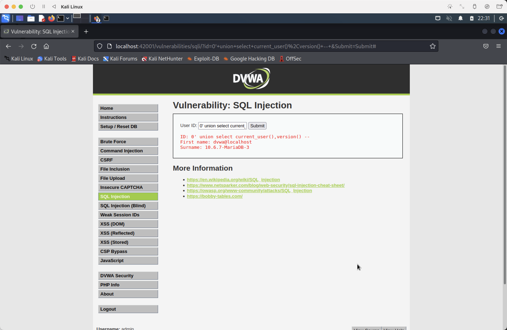
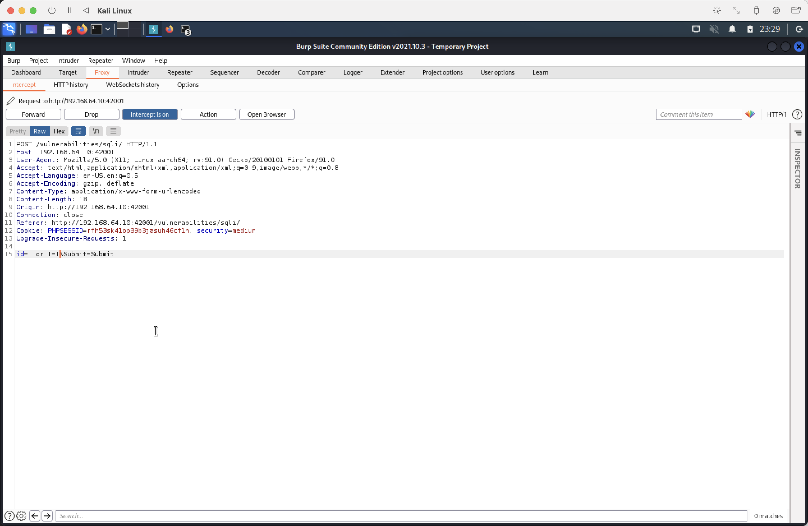
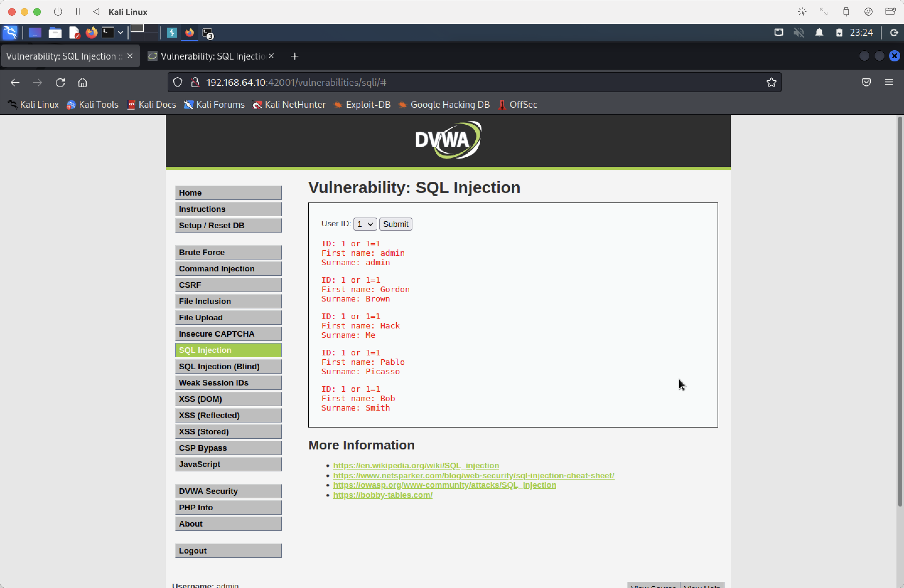
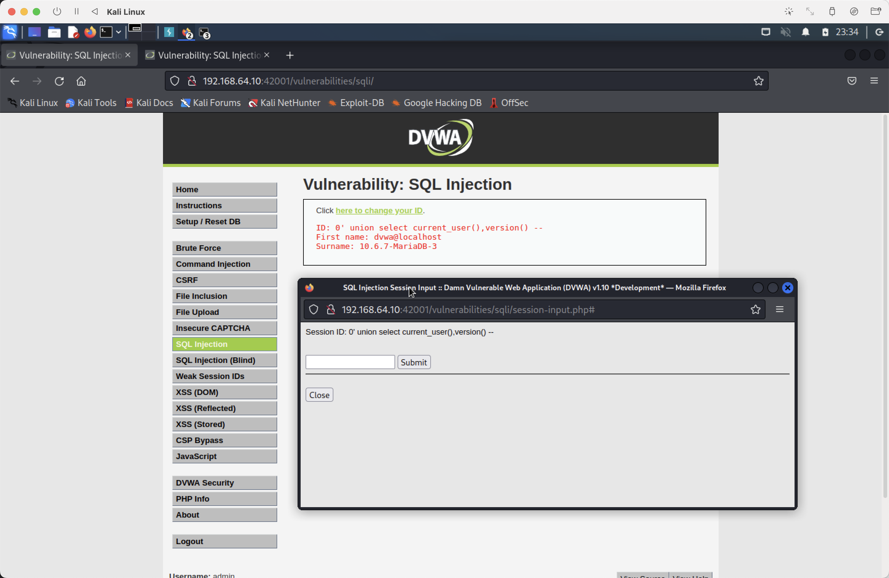

# Ex6

SQL回显注入

## Low等级

* 以下为页面源代码

```php
if( isset( $_REQUEST[ 'Submit' ] ) ) {
    // Get input
    $id = $_REQUEST[ 'id' ];

    switch ($_DVWA['SQLI_DB']) {
        case MYSQL:
            // Check database
            $query  = "SELECT first_name, last_name FROM users WHERE user_id = '$id';";
            $result = mysqli_query($GLOBALS["___mysqli_ston"],  $query ) or die( '<pre>' . ((is_object($GLOBALS["___mysqli_ston"])) ? mysqli_error($GLOBALS["___mysqli_ston"]) : (($___mysqli_res = mysqli_connect_error()) ? $___mysqli_res : false)) . '</pre>' );

            // Get results
            while( $row = mysqli_fetch_assoc( $result ) ) {
                // Get values
                $first = $row["first_name"];
                $last  = $row["last_name"];

                // Feedback for end user
                echo "<pre>ID: {$id}<br />First name: {$first}<br />Surname: {$last}</pre>";
            }

            mysqli_close($GLOBALS["___mysqli_ston"]);
            break;
        // ...省略无关部分
    } 
} 
```

由源代码分析可知，Low等级没有做任何防护，直接将用户输入内容作为SQL语句进行拼接，在这种情况下，黑客可以通过构造恶意内容将SQL语句中断并注入恶意代码，以达到修改程序数据或是非法访问数据的目的。

在这个案例中，只需要用户输入包含```单引号```，便可以对语句进行截断，根据运行结果，可以判断出加载字段的列数。

确定字段列以后便可以将对应的内容，通过```联合查询```的方式获取数据。

在这个案例中，输入```0' union select current_user(),version() -- ```，便可以获取到网站连接数据库用户信息以及数据库版本信息。

最终拼接的语句为```SELECT first_name, last_name FROM users WHERE user_id = '0' union select current_user(),version() -- ';```

由于不存在UID为0的用户，所以只会返回黑客想要的信息。




## Medium等级

* 以下为页面源代码

```php
if( isset( $_POST[ 'Submit' ] ) ) {
    // Get input
    $id = $_POST[ 'id' ];

    $id = mysqli_real_escape_string($GLOBALS["___mysqli_ston"], $id);

    switch ($_DVWA['SQLI_DB']) {
        case MYSQL:
            $query  = "SELECT first_name, last_name FROM users WHERE user_id = $id;";
            $result = mysqli_query($GLOBALS["___mysqli_ston"], $query) or die( '<pre>' . mysqli_error($GLOBALS["___mysqli_ston"]) . '</pre>' );

            // Get results
            while( $row = mysqli_fetch_assoc( $result ) ) {
                // Display values
                $first = $row["first_name"];
                $last  = $row["last_name"];

                // Feedback for end user
                echo "<pre>ID: {$id}<br />First name: {$first}<br />Surname: {$last}</pre>";
            }
            break;
        // ...省略无关部分
    }
}

// This is used later on in the index.php page
// Setting it here so we can close the database connection in here like in the rest of the source scripts
$query  = "SELECT COUNT(*) FROM users;";
$result = mysqli_query($GLOBALS["___mysqli_ston"],  $query ) or die( '<pre>' . ((is_object($GLOBALS["___mysqli_ston"])) ? mysqli_error($GLOBALS["___mysqli_ston"]) : (($___mysqli_res = mysqli_connect_error()) ? $___mysqli_res : false)) . '</pre>' );
$number_of_rows = mysqli_fetch_row( $result )[0];

mysqli_close($GLOBALS["___mysqli_ston"]); 
```

根据源代码分析可知，Medium等级相较于Low等级增加了真实字符转义，对于```单引号```等与SQL语法相关的字符，前面都会被自动添加反斜杠，那么在上一任务所使用的输入数据便无法完成攻击了。

尽管如此，在不使用```单引号```的情况下，也可以通过数值型注入的方式进行攻击。

比如构造注入数据```1 or 1=1```，最终程序执行所执行的SQL语句便为```SELECT first_name, last_name FROM users WHERE user_id = 1 or 1=1;```，在这种情况下，会泄漏大量用户信息，危害较大。

由于网页采用单选框的方式进行传递数据，所以无法直接完成用户输入，需要采用**BurpSuite**进行辅助。



最终可以得到以下结果。



## High级别

* 以下为页面源代码

```php
if( isset( $_SESSION [ 'id' ] ) ) {
    // Get input
    $id = $_SESSION[ 'id' ];

    switch ($_DVWA['SQLI_DB']) {
        case MYSQL:
            // Check database
            $query  = "SELECT first_name, last_name FROM users WHERE user_id = '$id' LIMIT 1;";
            $result = mysqli_query($GLOBALS["___mysqli_ston"], $query ) or die( '<pre>Something went wrong.</pre>' );

            // Get results
            while( $row = mysqli_fetch_assoc( $result ) ) {
                // Get values
                $first = $row["first_name"];
                $last  = $row["last_name"];

                // Feedback for end user
                echo "<pre>ID: {$id}<br />First name: {$first}<br />Surname: {$last}</pre>";
            }

            ((is_null($___mysqli_res = mysqli_close($GLOBALS["___mysqli_ston"]))) ? false : $___mysqli_res);        
            break;
        // ...省略无关部分
    }
}

```

根据源代码分析可知，High等级相较于Low等级增加了返回结果数量限制，但是没有对真实字符进行转义，所以可以采用Low等级中所使用的构造数据完成攻击。



## Impossible等级的机制以及修复、防御方法

* 以下为页面源代码

```php

if( isset( $_GET[ 'Submit' ] ) ) {
    // Check Anti-CSRF token
    checkToken( $_REQUEST[ 'user_token' ], $_SESSION[ 'session_token' ], 'index.php' );

    // Get input
    $id = $_GET[ 'id' ];

    // Was a number entered?
    if(is_numeric( $id )) {
        $id = intval ($id);
        switch ($_DVWA['SQLI_DB']) {
            case MYSQL:
                // Check the database
                $data = $db->prepare( 'SELECT first_name, last_name FROM users WHERE user_id = (:id) LIMIT 1;' );
                $data->bindParam( ':id', $id, PDO::PARAM_INT );
                $data->execute();
                $row = $data->fetch();

                // Make sure only 1 result is returned
                if( $data->rowCount() == 1 ) {
                    // Get values
                    $first = $row[ 'first_name' ];
                    $last  = $row[ 'last_name' ];

                    // Feedback for end user
                    echo "<pre>ID: {$id}<br />First name: {$first}<br />Surname: {$last}</pre>";
                }
                break;
            // ...省略无关部分
        }
    }
}

// Generate Anti-CSRF token
generateSessionToken(); 
```

根据源代码分析可知，Impossible等级相较于其它等级使用了```PDO```方式进行SQL语句构造，在这种情况下基本上不可能实现SQL注入，但也不排除特定版本的PDO存在漏洞，可以针对某些版本进行注入攻击。
